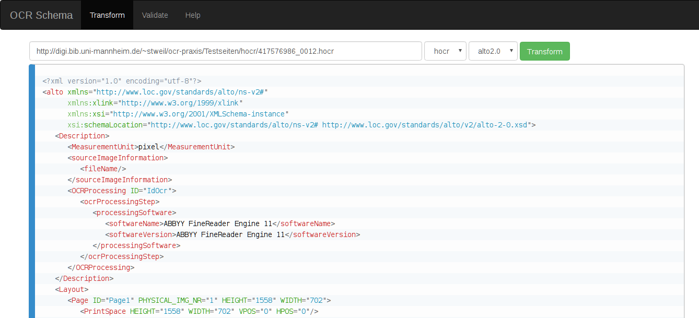

# ocr-fileformat

[](https://travis-ci.org/UB-Mannheim/ocr-fileformat)

Validate and transform between OCR file formats (hOCR, ALTO, PAGE, FineReader)



<!-- vim :GenTocGFM -->
* [Installation](#installation)
* [Usage](#usage)
	* [CLI](#cli)
	* [API](#api)
* [Transformation](#transformation)
	* [Transformation CLI](#transformation-cli)
	* [Transformation GUI](#transformation-gui)
	* [Transformation API](#transformation-api)
	* [Supported Transformations](#supported-transformations)
* [Validation](#validation)
	* [Validation CLI](#validation-cli)
	* [Validation GUI](#validation-gui)
	* [Validation API](#validation-api)
	* [Supported Validation Formats](#supported-validation-formats)
* [License](#license)

## Installation

To install system-wide to `/usr/local`:

```sh
sudo make install
```

To install without `sudo` to your home directory:

```sh
make install PREFIX=$HOME/.local
```

If `$HOME/.local/bin` is not in your `PATH`, add this to your shell startup file (e.g. `~/.bashrc` or `~/.zshrc`):

```
export PATH="$HOME/.local/bin $PATH"
```

The web application has a PHP backed. You can deploy it on any PHP-capable
server by copying the [`web`](./web) folder somewhere below the document root
of your server, e.g. `/var/www/html` for Apache on Debian/Ubuntu:

```
sudo -u www-data cp -r web /var/www/html/ocr-fileformat
```

In this example the GUI would be available under [http://localhost/ocr-fileformat/](http://localhost/ocr-fileformat/).

## Usage

The project offers two functionalities, which can be accessd via a command line
script (CLI), using a web interface (GUI) or in you own tools (API)

### CLI

* [`ocr-transform`](./blob/master/bin/ocr-transform.sh): Transformation of OCR output between OCR formats
* [`ocr-validate`](./blob/master/bin/ocr-validate.sh): Validation of OCR output against OCR format schemas

### API

* [`$PREFIX/share/ocr-fileformat/xslt`](./xslt) - XSLT stylesheets
* [`$PREFIX/share/ocr-fileformat/xsd`](./xsd) - XSD schemas

## Transformation

### Transformation CLI

```
Usage: ocr-transform [-dl] <input-fmt> <output-fmt> [<input> [<output>]] [-- <saxon_opts>]
```

For example, you can transform an ALTO XML to a hOCR file with:

```sh
ocr-transform alto hocr sample.xml sample.hocr
```

Or convert from ALTO XML (version 2.1) to hOCR with:

```sh
ocr-transform alto2.1 hocr sample.alto sample.hocr
```

You can also pass arguments directly to the Saxon CLI by passing them after a double dash (`--`). For example, to set the `foo` parameter to `bar`:

```sh
ocr-transform alto hocr sample.xml sample.hocr -- foo=bar
```

Try `ocr-transform -h` to get an overview:

```
Usage: ocr-transform [-dl] <input-fmt> <output-fmt> [<input> [<output>]] [-- <saxon_opts>]
Input formats:
- 'alto'
- 'hocr'
Output formats:
- 'alto2.0'
- 'alto2.1'
- 'hocr'
Saxon-HE 9.7.0.4J from Saxonica
Java version 1.7.0_95
Usage: see http://www.saxonica.com/html/documentation/using-xsl/commandline.html
Options available: -? -a -catalog -config -cr -diag -dtd -ea -expand -explain -export -ext -im -init -it -l -license -m -nogo -now -o -opt -or -outval -p -pack -quit -r -repeat -s -sa -scmin -strip -t -T -threads -TJ -TP -traceout -tree -u -val -versionmsg -warnings -x -xi -xmlversion -xsd -xsdversion -xsiloc -xsl -xsltversion -y
Use -XYZ:? for details of option XYZ
Params: 
param=value           Set stylesheet string parameter
+param=filename       Set stylesheet document parameter
?param=expression     Set stylesheet parameter using XPath
!param=value          Set serialization parameter
```

### Transformation GUI

Select the `Transform` menu option. Choose a URL, an input and an output
format. Click `Transform`.

### Transformation API

The stylesheets are installed in `$PREFIX/share/ocr-fileformat/xslt` and can be
used directly in your scripts and software. You will need to use an XSLT 2.0
capable stylesheet transformer.

### Supported Transformations

|  From ╲ To | hOCR                     | ALTO                     | PAGEXML                  | FineReader               |
|-----------:|--------------------------|--------------------------|--------------------------|--------------------------|
|       hOCR | -                        | :white_check_mark:       | :heavy_multiplication_x: | :heavy_multiplication_x: |
|       ALTO | :white_check_mark:       | :heavy_multiplication_x: | :heavy_multiplication_x: | :heavy_multiplication_x: |
|       PAGE | :heavy_multiplication_x: | :heavy_multiplication_x: | -                        | :heavy_multiplication_x: |
| FineReader | :heavy_multiplication_x: | :heavy_multiplication_x: | :heavy_multiplication_x: | -                        |

## Validation

```
Usage: ocr-validate [-dh] <schema> <file>

```

### Validation CLI

For example, to validate an XML file againt the ALTO 3.1 schema:

```
ocr-validate alto-3-1 myFile.alto
```

### Validation GUI

Select the `Validate` menu option. Choose a URL and an schema. Click `Validate`.

### Validation API

The XSD files are installed under `$PREFIX/share/ocr-fileformat/xsd`

### Supported Validation Formats

|            | hOCR                     | ALTO               | PAGEXML                  | FineReader         |
|-----------:|--------------------------|--------------------|--------------------------|--------------------|
| Validation | :heavy_multiplication_x: | :white_check_mark: | :white_check_mark:       | :white_check_mark: |


## License

The XSL stylesheets for hOCR-ALTO and ALTO-hOCR transformation are licensed
[Creative Commons Attribution-ShareAlike 4.0 International.(CC BY-SA
4.0)](https://creativecommons.org/licenses/by-sa/4.0/legalcode).

Projects included during the installation process (in [`./vendor`](./blob/master/vendor)):
* [Saxon HE 9.7](http://saxon.sourceforge.net/#F9.7HE), [`MPL`](https://www.mozilla.org/MPL/).
* [ALTOXML schema](/altoxml/schema), [`Open Source`](https://github.com/altoxml/schema/issues/37#issuecomment-218730230)
* [PAGE schemas](http://www.primaresearch.org/schema/PAGE/gts/pagecontent/), `?`
* [xsd-validator](/amouat/xsd-validator), `Apache 2.0`
* ABBYY FineReader XSD, `?`
* [hOCR-to-ALTO](https://github.com/kba/hOCR-to-ALTO) by Filip Kriz, `CC BY-SA 4.0`
